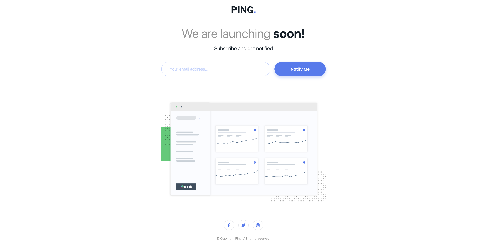

# Ping coming soon page

## Table of contents

- [Overview](#overview)
  - [Screenshot](#screenshot)
  - [Links](#links)
- [My process](#my-process)
  - [Built with](#built-with)
- [Author](#author)

## Overview

### Screenshot

### Links

- Solution URL: [Solution URL](https://github.com/kisu-seo/ping_single_column_coming_soon_page)
- Live Site URL: [Live URL](https://kisu-seo.github.io/ping_single_column_coming_soon_page/)

## My process

### Built with

- **Semantic HTML5** - Proper use of `<header>`, `<main>`, `<section>`, `<footer>`
- **Tailwind CSS CDN** - Rapid development with utility-first CSS
- **Custom Tailwind Components** - Reusable classes with `@layer components` and `@apply`
- **Pixel-Perfect Design** - Precise values like `max-w-[319.94px]`, `h-[15.24px]` for exact layout
- **Custom Design System** - Text presets, color palette, and spacing tokens in `tailwind.config.js`
- **Flexbox Layout** - Responsive layout with flex containers
- **Mobile-First Responsive** - Breakpoint-based design (mobile → tablet → desktop)
- **Conditional Absolute Positioning** - Mobile: relative flow, Desktop: absolute for error messages (prevents Layout Shift)
- **Dynamic Margin Control** - JavaScript-driven margin adjustment on error state (`mb-[70px]` → `mb-[35px]`)
- **Vanilla JavaScript** - No frameworks, pure DOM manipulation
- **Email Validation** - Regex pattern matching for proper email format
- **Real-time Error Handling** - Instant feedback on user input
- **Accessibility (a11y)** - ARIA labels, semantic markup, keyboard navigation support

## Author

- Website - [Kisu Seo](https://github.com/kisu-seo)
- Frontend Mentor - [@kisu-seo](https://www.frontendmentor.io/profile/kisu-seo)
